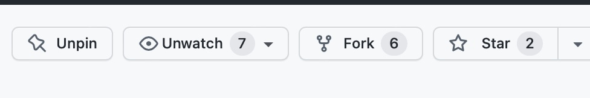
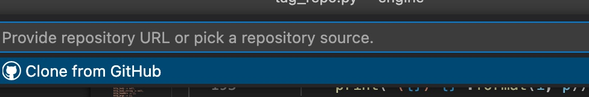
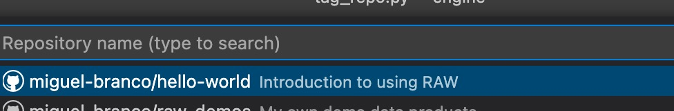

# Clone the 'Hello World' repository

To get started, clone our sample 'Hello World' repository

For this, navigate to this [Github repository](https://github.com/raw-labs/hello-world) and click on 'Fork' as shown below.

Once you have forked the repository into your own GitHub account, you must then clone it locally.

For this, press `CTRL + SHIFT + P` (or `COMMAND + SHIFT + P` on MacOs) and type 'Git: Clone'.

Choose 'Clone from GitHub'.

Now choose the 'Hello World' repository and pick a local directory to clone it.

You now have the repository ready and are ready for the next step.
