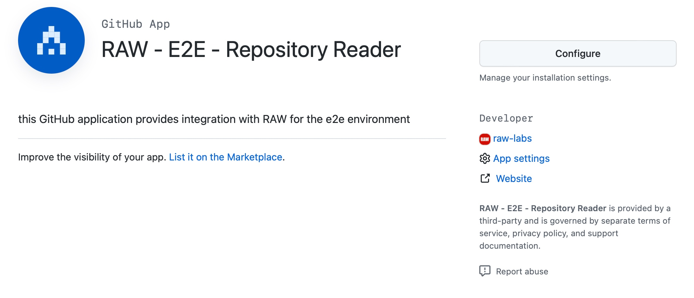
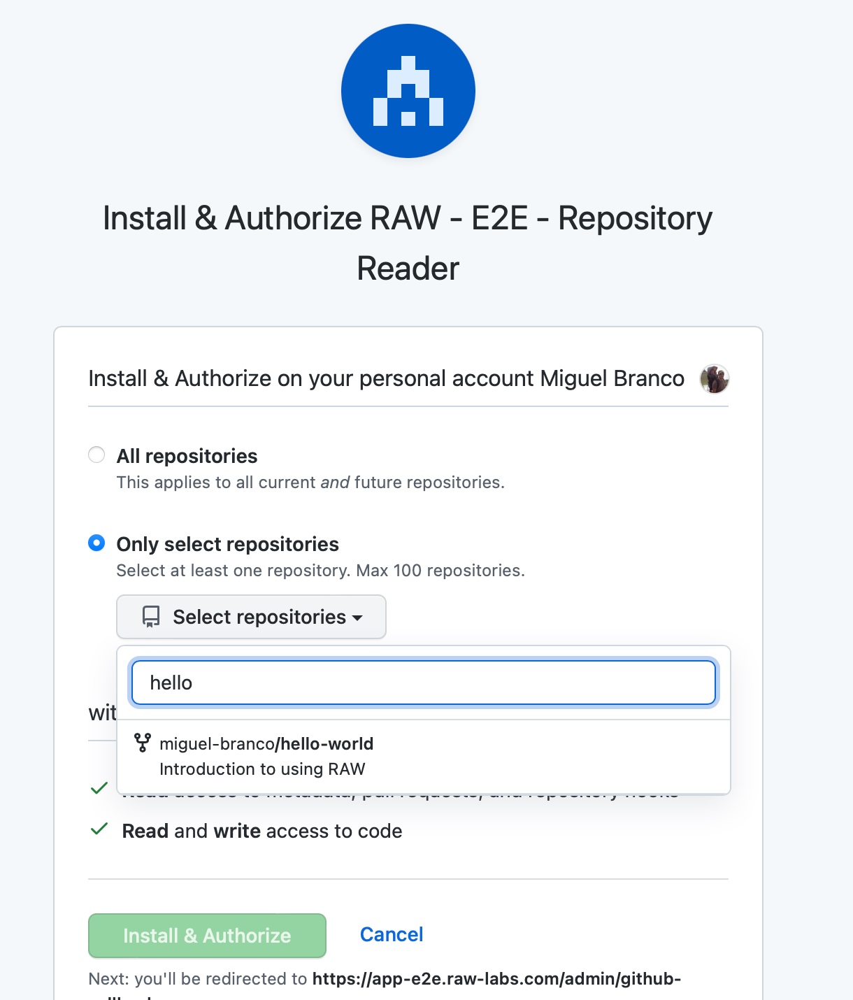

# Grant RAW permissions to read the 'Hello World' repository

RAW creates data APIs out of GitHub repositories.

For this, RAW needs permissions to read the corresponding GitHub repositories.

To grant permissions to read the subset of repositories, click here [Grant RAW permissions on GitHub](https://github.com/apps/raw-repository-reader)

You must allow RAW to read the 'Hello World' repository that you forked earlier.

We recommend choosing "Only Selected Repositories" and picking the 'Hello World' repository.

*Note that every repository being published as an API must be allowed in this list*.

