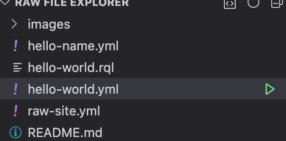

# Test the 'Hello World" API

Now that RAW can access your GitHub repository, it's time to test it.

For this, navigate to file `hello-world.yml` in your local cloned copy.

Then press <Play> as shown below.

You should see the execution result. If successful, you are ready to go.

If you find any issue, refer to the [Documentation](https://raw-labs.com/docs/) or reach us directly on our [Slack](https://app.slack.com/client/TA26FV8LU) channel.